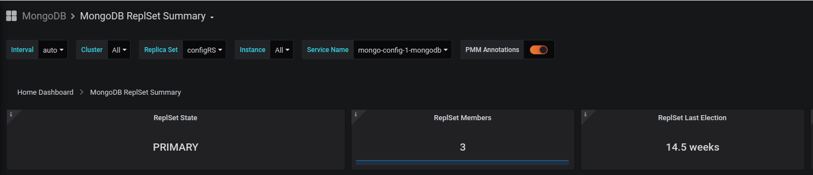
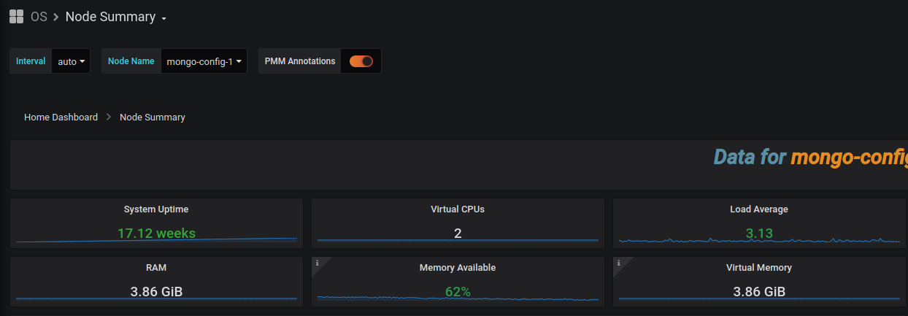

# MongoDB Production replication set with terraform/ansible

## DISCLAIMER

Please note: all tools/ scripts in this repo are released for use "AS IS" without any warranties of any kind, including, but not limited to their installation, use, or performance. We disclaim any and all warranties, either express or implied, including but not limited to any warranty of noninfringement, merchantability, and/ or fitness for a particular purpose. We do not warrant that the technology will meet your requirements, that the operation thereof will be uninterrupted or error-free, or that any errors will be corrected. Any use of these scripts and tools is at your own risk. There is no guarantee that they have been through thorough testing in a comparable environment and we are not responsible for any damage or data loss incurred with their use. You are responsible for reviewing and testing any scripts you run thoroughly before use in any non-testing environment.

## Contribute

Don't hesitate to subscribe pull requests if you find a bug or you want to add a new feature.
If you find a security issue you can contact me directly on my email (in my profile).

## Introduction

This repo is in charge of creating a 3 nodes replica set with mongoDB **ALMOST** ready for production. This will:

- Provision with terraform the necessary resources (ssh keys, ips, security groups, instances, volumes...)
- Setup mongodb with a 3 node replicaset and one arbiter.
- Setup monitoring using [percona pmm](https://www.percona.com/software/database-tools/percona-monitoring-and-management) (based on prometheus and grafana).
- Setup automatic backup with AWS S3


I invite you to have an fresh/clean environment (4 nodes newly created).

This is under MIT liscence so you can use it and modify it as you want.

## Security: What is covered ?

According to the [security checklist](https://docs.mongodb.com/v3.2/administration/security-checklist/):

- [x] Enable Access Control and Enforce Authentication: We will create a userAdminAnyDatabase, root and dedicated user

- [x] Configure Role-Based Access Control: We will create a userAdminAnyDatabase, root and dedicated user

- [x] Encrypt Communication: We will use lets encrypt to generate tls certificate + accessKey for communication between members.

- [x] Encrypt and Protect Data: We will use encryption at rest (with LVM and Luks)

- [x] Limit Network Exposure: This is achieved with security groups when using terraform

- [ ] Audit System Activity: As this is an Entreprise feature we won't see it in this article

- [x] Run MongoDB with a Dedicated User: We will run mongod with user mongodb (group mongodb)

- [x] Run MongoDB with Secure Configuration Options: We will deactivate script with the mongod.conf security.javascriptEnabled. As well net.http.enabled, net.http.RESTInterfaceEnabled, net.http.JSONPEnabled are by default deactivated as mentionned here

- [ ] Request a Security Technical Implementation Guide: This is out of scope. This needs to be done by the system administrator. You can request a copy

- [ ] Consider Security Standards Compliance: This is out of scope. This needs to be done by the system administrator. You can take a look here MongoDB Security Reference Architecture

## Setup with terraform

We will use terraform v0.12.20

> Please note that you will be charged by your cloud provider.

Currently here are the providers implemented (don't hesitate to contribute to add new providers):

- [x] Scaleway 
- [x] AWS
- [ ] Openstack on premise
- [ ] Openstack OVH
- [ ] GCP
- [ ] Azure

What will be created (the resources names can differ from a cloud provider to another but have the same behavior):

- 4 Elastic IPs (public fixed IPs)
- 1 security group with following rules
  - Allow all port from Devops home (called `home_ip` in variables)
  - Allow port 80 and 443 from everywhere to allow later letsencrypt renewal (closing of the port will be done with firewalld. See ansible section)
  - Allow port 27017 from all members of the security groups
  - Allow ports 42000 to 42005 from all members of the security groups (for monitoring)
  - Allow port 8443 from all members of the security groups (for monitoring)
- 4 instances (one for each nodes)
- 4 volumes attached to the 4 nodes

### Scaleway setup

To setup scaleway you need to go on the Dashboard then in **Credentials** and go to **API TOKEN** section. 
Generate a new key (be carreful the private key will be shown just one time).
When it is done add them in the `terraform/scaleway/variable.tf`.

### AWS setup

To setup AWS you need to go on IAM and create a new user with EC2FullAccess (be carreful the private key will be shown just one time)
When it is done you need before running terraform to export the AWS variable:

```
$ export AWS_ACCESS_KEY_ID="<access_key>"
$ export AWS_SECRET_ACCESS_KEY="<secret key>"
$ export AWS_DEFAULT_REGION="eu-west-3"
```

### RUN

```
$ terraform init
$ terraform plan
# When ready run
$ terraform apply
# To destroy your stack
$ terraform destroy
```

## Pre-install setup

### DNS

You need an official domain name as it will be used for Lets encrypt SSL certificate generation/renewal.
All node needs subdomain registered in an official DNS.

Example: You are owner of `my-domain.com`
You need DNS entries:

```
NAME                             TTL         TYPE          DATA
mongo-1.my-domain.fr             3600        A             ip_mongo_1
mongo-2.my-domain.fr             3600        A             ip_mongo_2
mongo-3.my-domain.fr             3600        A             ip_mongo_3
mongo-arbiter.my-domain.fr       3600        A             ip_mongo_arbiter
```

### Sudo

Ensure that sudo is installed on all host and that user is in sudoer list (in `/etc/sudoers`)

### Access key

To not reuse the default mongodb keyfile you can run:

```
$ openssl rand -base64 756 > ansible/roles/security/files/mongo-keyfile
```

## Ansible

Here will use ansible 2.9

Thinks about modifying the `./ansible/hosts.yaml` file. Here is the signification of the differentes variables/children:

### mongodb
Here we will put all our host. You can notice variables such as:

- `host_name`: The name of the host.
- `host_ip`: The public IP of your host
- `host_private_ip`: Not mandatory. When using public IPs such as elastic ips in AWS, or flexible ips for scaleway. The `host_private_ip` will be used for mongodb binding. `host_ip` will be use to join monitoring server. The private ip can be found by launching command `ifconfig`
- `cron_renew_day`: this is the renewal day of week in cron language (0 for Sunday to 1 for Saturday). We will launch the job every week on this specific day at 03:30AM. You can notice that we don't set the same so in case of any issue you have 24 hours to fix it.


### primary/secondaries/arbiter
We could do this by using variable but I prefer in term of visibility to use dedicated children node even if I copy the host from mongodb hosts. This gives as well the possibility to add new variable such as the priority for secondaries.

### monitoring_server
The server on which the monitoring tools will be install. Can be your arbiter

### monitoring_clients
The server which will be monitored

### backup_server
The server on which the backup will be performed. Can be your arbiter

### Variables

- `remote_user`: the remote user which will be use to connect to vms
- `mongodb_replicaset_name`: the name you want to give to your replicaset
- `mongodb_db_path`: the path on which you want to store your data. Will be mounted on the encrypted partition
- `mongodb_user_user_admin_any_database_name`: the first user which will be created with rights userAdminAnyDatabase
- `mongodb_user_user_admin_any_database_password`: The password of the userAdminAnyDatabase user
- `mongodb_user_root_name`: The root user with rights root
- `mongodb_user_root_password`: The password of root user
- `mongodb_main_database`: The main database for your application
- `mongodb_user_readwrite_main_database_name`: A user with readWrite access on the main database
- `mongodb_user_readwrite_main_database_password`: The password of the readWrite user
- `partitioning_device_name`: The name of the device for partition used for encryption (ie: `/dev/sdb` for scaleway `/dev/nvme0n1` for ebs on aws)
- `partitioning_partition_name`: The name of the partition used for encryption (ie: `/dev/sdb1` for scaleway `/dev/nvme0n1p1` for ebs on aws)
- `partitioning_luks_passphrase`: The passphrase for your encryption. Keep this passphrase safe and don't loose it
- `partitioning_luks_name`: the name of the encrypted partition
- `partitioning_vg_name`: The LVM volume group name
- `partitioning_lv_name`: The LVM volume name
- `certbot_admin_email`: your email for certbot
- `monitoring_password`: the password used on grafana
- `monitoring_db_user_name`: the user in db which will have clusterMonitor role
- `monitoring_db_user_password`: the password of the clusterMonitor user
- `backup_db_user_name`: the user in db which will have backup role
- `backup_db_user_password`: the password of the backup user
- `backup_region`: the S3 region on which your bucket is hosted
- `backup_secret`: the secret key of your s3 user
- `backup_public`: the public key of your s3 user
- `backup_minute`: the minutes for your backup cron job
- `backup_hour`: the hour for your backup hour

### Run 

To run simply execute:

```
$ ansible-playbook -i ansible/hosts.yml playbook-full-configuration.yml
```

Here are the differents plays which will be executed:

- On all hosts:
  - `prepare-host`: Install MongoDB and perform some configuration (transparent_hugepage)
  - `encrypt-rest`: Create a volume with LVM and mount it on the future `mongodb_db_path`. The LVM will be created on an Encrypted device with LUKS
  - `security`: Use mongodb keyfile, install let's encrypt to use TLS termination. Add cron to renew the certificates
  - `mongodb`: Configure and start mongodb

- On primary:
  - `replica-set`: Init and configure replicaset (add secondaries and arbiter)
  - `monitoring-create-user`: Create all users (one with userAdminAnyDataBase rights, one with root and one with readWrite on the `mongodb_main_database`)

- On monitoring_server:
  - `monitoring-server`: Install and start monitoring server (pmm)

- On monitoring_clients:
  - `monitoring-clients`: Install monitoring client on all clients and join the server

- On primary:
  - `backup-create-user`: Create user with backup rights

- On backup_server:
  - `backup`: Create the backup cron job

If you just want to run some part you have some predefined playbooks.

### Replay

If you get an error most of the steps have checks so you can simply rerun the playbook after providing your fix.

### Connect to your DB

You can now connect to your DB from your `home_ip` with:

```
$ mongo "mongodb://mongo-1.my-domain.fr:27017,mongo-2.my-domain.fr:27017,mongo-3.my-domain.fr:27017/main?replicaSet=rs0" --ssl --username main-user --password "strong-password-3"
```

### Monitoring

As explained above monitoring is done with the really complete and powerfool opensource tool [percona pmm](https://www.percona.com/software/database-tools/percona-monitoring-and-management) (based on prometheus and grafana).
You will have access to plenty of data like:

- Node CPU, Memory, Network and disk usage
- MongoDB cluster summary, inMemoryDetails, Replicaset information and WiredTiger.
- Query analytic (to see query efficiency)

Here are some graphs:






Here is the official percona [grafana](https://pmmdemo.percona.com/graph/d/pmm-home/home-dashboard?orgId=1&refresh=1m)
